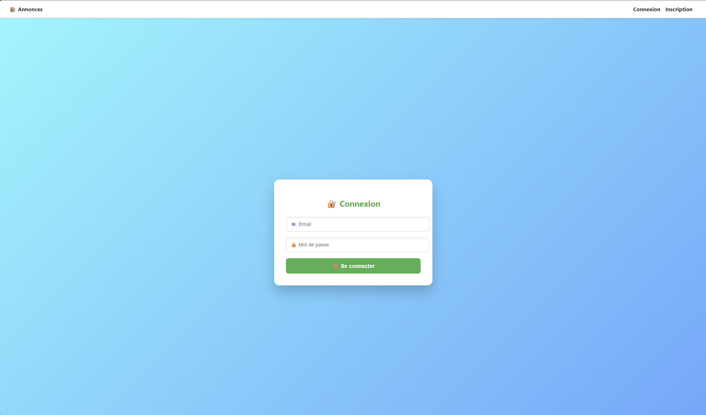
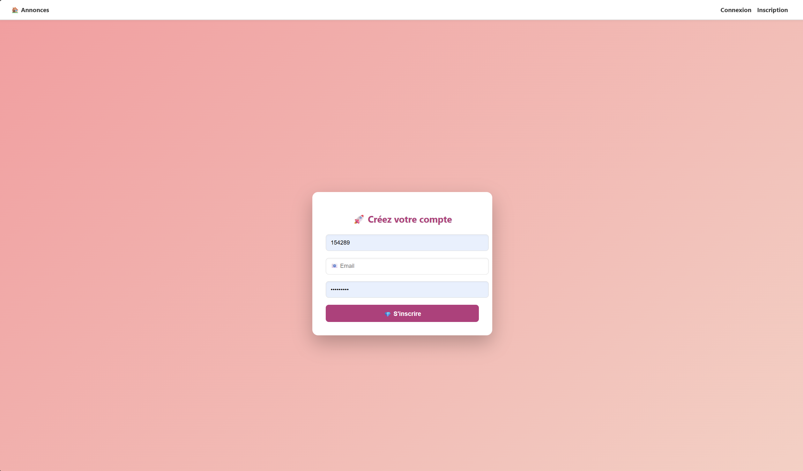
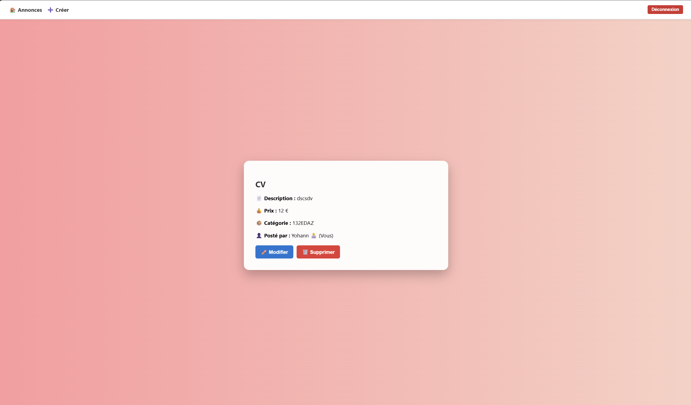
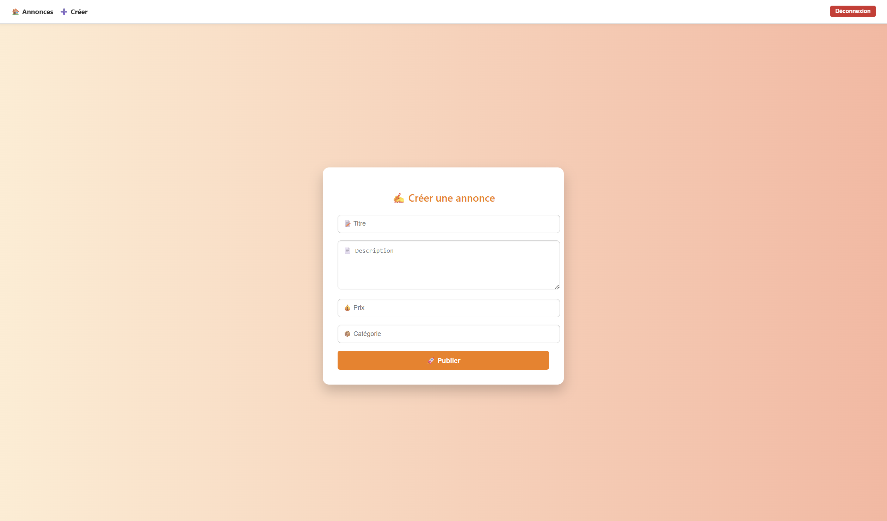
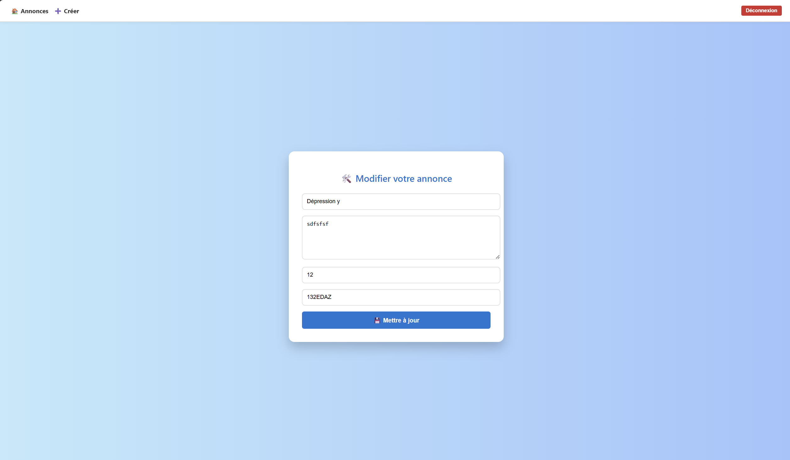

# 🛍️ Le Bon Coin - Clone MERN Stack

Une application complète MERN (MongoDB, Express, React, Node.js) permettant à des utilisateurs de publier, modifier, supprimer et consulter des petites annonces. Inspirée de "Le Bon Coin", cette version simplifiée inclut un système sécurisé d'authentification, une gestion CRUD complète des annonces, et une interface moderne.

---

## ✨ Aperçu visuel

### 🔐 Page d'authentification




### 📋 Liste des annonces


### 🧾 Détails et actions sur une annonce



### 🛠️ Création / Modification d’une annonce




---

## 🚀 Fonctionnalités

- 🔐 Authentification (Inscription / Connexion)
- 📝 Création, consultation, modification et suppression des annonces
- 🧑‍💼 Autorisation : seuls les auteurs peuvent modifier/supprimer leurs annonces
- 🌐 Interface stylisée avec effets visuels et navigation conditionnelle
- 📱 Responsive et fluide

---

## 🧰 Technologies

| Frontend     | Backend          | Base de données | Sécurité         |
|--------------|------------------|------------------|------------------|
| React.js     | Node.js + Express| MongoDB          | JWT + bcryptjs   |

---

## 📁 Structure du projet

```

TPIndiv/
├── backend/
│   ├── controllers/
│   ├── middleware/
│   ├── models/
│   ├── routes/
│   └── server.js
├── frontend/
│   ├── src/
│   │   ├── components/
│   │   ├── pages/
│   │   ├── services/
│   │   └── App.js
│   └── package.json

````

---

## 🔧 Installation

### 1️⃣ Cloner le dépôt

```bash
git clone https://github.com/ton-utilisateur/leboncoin-clone.git
cd leboncoin-clone
````

---

### 2️⃣ Lancer le backend

```bash
cd backend
npm install
```

Créer un fichier `.env` :

```env
PORT=5000
MONGO_URI=mongodb://localhost:27017/leboncoin
JWT_SECRET=superSecretToken
```

Démarrer le serveur :

```bash
npm start
```

---

### 3️⃣ Lancer le frontend

```bash
cd ../frontend
npm install
npm start
```

📍 L'application sera disponible sur :
👉 [http://localhost:3000](http://localhost:3000)

---

## 🔐 Pages protégées

| Page                   | Accès                |
| ---------------------- | -------------------- |
| `/listings`            | Public               |
| `/listings/:id`        | Public               |
| `/create`              | Authentifié          |
| `/listings/:id/edit`   | Authentifié + Auteur |
| `/login` / `/register` | Non connecté         |

---

## 🧪 Test rapide

1. Créer un compte
2. Créer une annonce
3. La consulter
4. L’éditer ou la supprimer si connecté
5. Tester l’accès à `/create` ou `/edit` sans être connecté

---

## ✍️ Auteur

Développé par **Yendi Yohann** dans le cadre d'un TP individuel MERN Stack.

---

## 📬 Contact

📧 [yendiyohann@gmail.com](mailto:yendiyohann@gmail.com)

